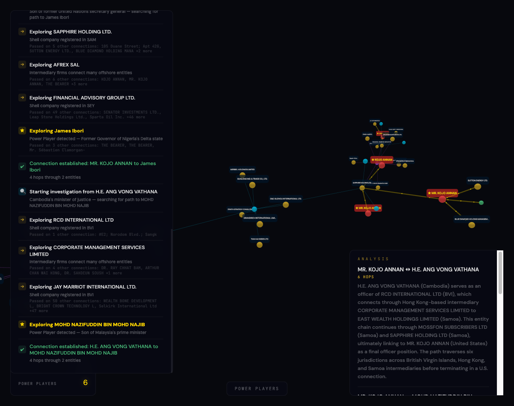

# Offshore Leaks Investigator

> Pick two world leaders. Watch an AI agent trace the hidden offshore connections between them through shell companies, intermediaries, and tax havens — all backed by real ICIJ data.

**[Live Demo](https://icij-offshore-leaks.vercel.app)** · **[Devpost](https://devpost.com/software/offshore-leaks-investigator)** · Built for [JacHacks 2026](https://jachacks.org)



## How It Works

1. **Pick Power Players** — A grid of 94 politically exposed persons (heads of state, PMs, intelligence chiefs) sourced from ICIJ's official database
2. **Agent Investigates** — A Jac PathFinder walker traces connections through shell companies, intermediaries, and shared addresses across jurisdictions
3. **Graph Reveals** — A 3D force-directed network visualizes the discovered path with labeled nodes, typed edges, and particle flow
4. **AI Summarizes** — Jac's `by llm()` generates a structural narrative constrained to graph facts. No speculation, no editorializing.

## Built-In Scenarios

| Scenario | Power Players | What It Shows |
|---|---|---|
| **The Annan Network** | UN Sec Gen's son, Cambodia's justice minister, Malaysian PM's son, Nigerian governor | 51-node web of shared offshore infrastructure across BVI, Samoa, Hong Kong |
| **Sudan · Iraq · UAE** | Former president of Sudan, ex-PM of Iraq, UAE president/emir | Connected through Child & Child (London law firm) and BVI shell companies |
| **Shared Address in Tortola** | El Salvador president, Lebanese PM, Putin's associate | All sharing one registered address: 3rd Floor, Yamraj Building, Road Town, BVI |

## Architecture

```
Frontend (Vercel)          Backend (Railway)
┌─────────────────┐        ┌──────────────────────────┐
│ 3D Force Graph   │──API──▶│ Jac API Server            │
│ Three.js         │  proxy │ PathFinder Walker (agent) │
│ PP Face Grid     │◀──────│ by llm() summaries        │
└─────────────────┘        │ SQLite (2M nodes, 3.3M    │
                           │  edges, FTS5 search)       │
                           └──────────────────────────┘
```

### Jac Features Used

| Feature | How We Use It |
|---|---|
| **Walkers** | `PathFinder` — stateful agent that receives targets, discovers paths via BFS, materializes a Jac graph, traverses it node by node, and generates AI summaries |
| **`by llm()`** | `summarize_connection()` — inline LLM call that narrates graph structure. Constrained to facts via docstring prompt. |
| **Nodes & Edges** | `Entity` nodes (officers, shell companies, addresses, intermediaries) + `LinkedTo` edges (officer_of, registered_address, intermediary_of) |
| **`:pub` endpoints** | `search`, `investigate`, `find_connections`, `get_power_players`, `get_node_detail` — auto-generated REST API via `jac start` |
| **Python interop** | Jac imports `db.icij_db` (Python SQLite module) directly for BFS pathfinding and FTS5 search |

### Agent Investigation Log

The PathFinder walker narrates every decision:

```
🔍 Starting investigation from AYAD ALLAWI
→  Exploring I.M.F. HOLDINGS INC. — Shell company registered in PMA
   Passed on 1 other connection: FOXWOOD ESTATES LIMITED
→  Exploring CHILD & CHILD — Intermediary firms connect many offshore entities
   Passed on 2 other connections: THE BEARER, THE BEARER
→  Exploring HILGARD MANAGEMENT LIMITED — Shell company registered in BVI
   Passed on 48 other connections: TROY DEVELOPMENTS LIMITED, EPSILON CONTROL SYSTEMS... +45 more
★  Exploring Khalifa bin Zayed bin Sultan Al Nahyan
   Power Player detected — UAE President, Abu Dhabi emir
✓  Connection established: AYAD ALLAWI to Khalifa bin Zayed — 6 hops through 3 entities
```

## Setup (Local Development)

```bash
# Clone
git clone https://github.com/drPod/icij-offshore-leaks-investigator.git
cd icij-offshore-leaks-investigator

# Download ICIJ data (~70MB) and build SQLite database (~50s)
python scripts/download_icij.py
python scripts/ingest_icij.py

# Set up API key for AI summaries
cp .env.example .env
# Edit .env with your Anthropic API key

# Start the Jac API server
jac start main.jac

# Open frontend (or use python3 -m http.server 8888)
open frontend/index.html
```

## API Endpoints

| Endpoint | Body | Description |
|---|---|---|
| `POST /function/get_power_players` | `{}` | 94 Power Players with images, titles, connectivity data |
| `POST /function/find_connections` | `{node_ids: [...]}` | Bidirectional BFS pathfinding between selected PPs + AI summaries |
| `POST /function/search` | `{query, limit?}` | FTS5 name search across 2M+ nodes |
| `POST /function/investigate` | `{node_id, max_depth?, max_nodes?}` | BFS subgraph expansion from a single node |
| `POST /function/get_node_detail` | `{node_id}` | Full node metadata + immediate connections + ICIJ source link |

## Data

- **Source**: [ICIJ Offshore Leaks Database](https://offshoreleaks.icij.org/) — Panama Papers, Paradise Papers, Pandora Papers, Bahamas Leaks, Offshore Leaks
- **Scale**: 2,016,523 nodes · 3,339,267 relationships · 157 tagged Power Players
- **Power Players**: [ICIJ Power Players list](https://offshoreleaks.icij.org/power-players) — 181 politically exposed persons (94 with database matches)
- **Storage**: SQLite with FTS5 full-text search, indexed on node_id and relationships

## Tech Stack

**Jac** · **Python** · **SQLite** · **Three.js** · **3d-force-graph** · **Claude API (Haiku)** · **Vercel** · **Railway** · **Docker**

## License

MIT — see [LICENSE](LICENSE)
